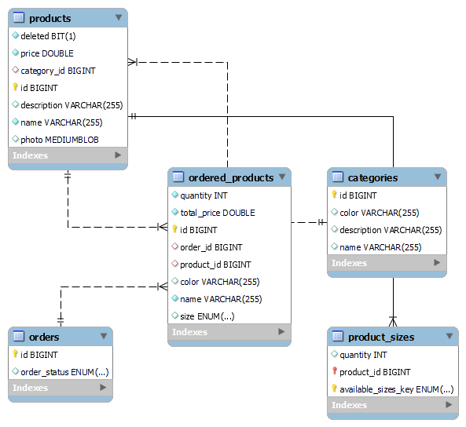

# Distribuidos_URJC

# 
 Urban Threads 

## 📑Index
- [Entrega 1](entrega-1)
  - [Descripción de la aplicación](descripcon-de-la-aplicacion)
  - [Miembros del equipo](miembros-del-equipo)
  - [Entidades](entidades)
- [Entrega 2](entrega-2)
  - [Intrucciones de ejecución](instrucciones-de-ejecucion)
     - [Pasos](pasos)
     - [Requerimientos](requerimientos)
     - [Configuración de la base de datos](configuracion-de-la-base-de-datos)
     - [Configuración del ide](configuracion-del-ide)
  - [Diagrama de la base de datos](diagrama-de-la-base-de-datos)

***   
### ♨️Entrega 1
***
## 🖋️Descripción de la aplicación
Esta apliación albergará una web para una tienda de ropa. De esta manera, toda persona que acceda, podrá navegar a través de los distintos productos y realizar compras.

## 👷Miembros del equipo
| Nombre | Correo URJC| usuario de Github |
| ------------- | ------------- | ----------- |
| Lucía Domínguez Rodrigo| l.dominguez.2021@alumnos.urjc.es | [@LuciaDominguezRodrigo](https://github.com/LuciaDominguezRodrigo) |
| Marcos Jiménez Pulido  | m.jimenezp.2021@alumnos.urjc.es  | [@MarJ03](https://github.com/MarJ03) |

## 📚Entidades
- **Producto**: entidad referente a los productos que se venderán en la tienda (ropa).
- **Categoria**: entidad referente a la categoría que tendrá un producto (hombre, mujer, en rebajas, new collection, etc.)
- **Pedido**: entidad referente al pedido que pueda realizar cualquier usuario que entre en la página

***   
### ♨️Entrega 2  - Web con base de datos relacional
***

## 🔣Intrucciones de ejecución

### 👟Pasos 
1. Descarga este repositorio
2. Comprueba los requerimientos
3. Configura la base de datos
4. Configura el IDE
5. Ejecuta la aplicación en el IDE
6. Ve a https://localhost/8080/

### 📋Requerimientos
- Java: JDK 17 --> https://www.oracle.com/java/technologies/javase/jdk17-archive-downloads.html
- MySQL: v.8.0.36.0 (Explicado en Configuración de la base de datos)
- Maven: 4.0.0
- Spring Boot 3.2.3
- IDE (explicado en Configuración del IDE)

### 💾Configuración de la base de datos
- Descarga MySQL v.8.0.36.0
- Selecciona el puerto por defecto (puerto 3306)
- Crea un usuario con nombre "root" y contraseña "password" con rol de DB admin
- Configura MySQL Server como Windows Service
- Garantiza el acceso total al usuario
- Crea un nuevo esquema llamado urbanthreads en el servidor usando MySQL Workbench

### 🕹️Configuración del IDE
- Hemos utizado IntelliJ IDEA, pero es posible utilizar otros IDE´S
- Instala Maven and Spring para tu IDE

## 🗃️Diagrama de la base de datos

*DataBase Diagram*
